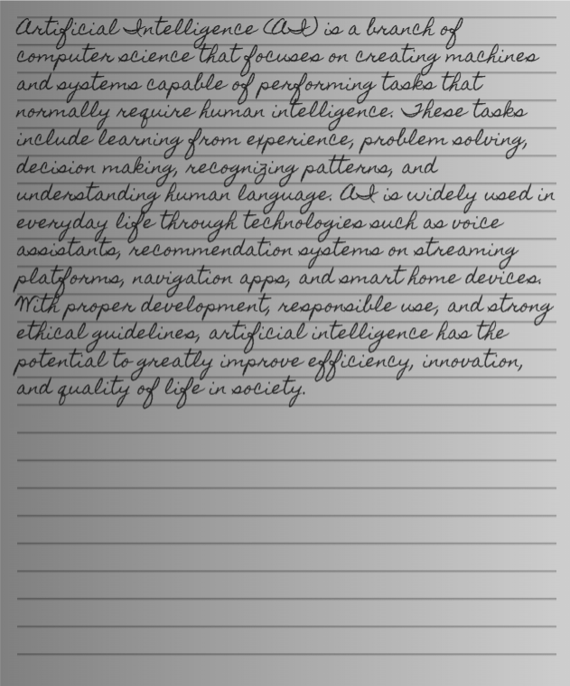
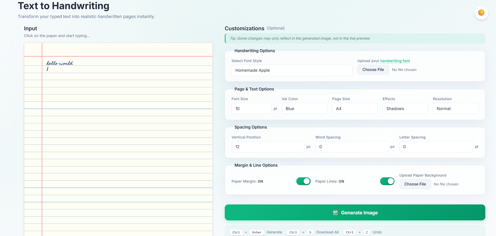
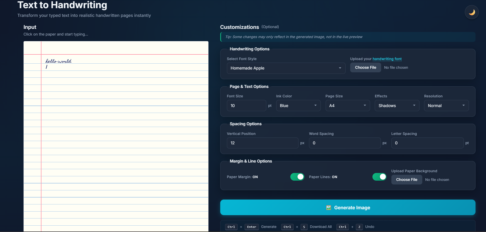

<h1 align="center">Text2Scribble</h1>

<p align="center">
  <strong>Transform Digital Text into Authentic Handwritten Documents</strong>
</p>

<p align="center">
  <a href="LICENSE">
    
  </a>
  <a href="https://github.com/RishiBuilds/text2scribble/stargazers">
    
  </a>
  <a href="https://github.com/RishiBuilds/text2scribble/network/members">
    
  </a>
</p>

<p align="center">
  
  
  
</p>

<p align="center">
  <a href="https://github.com/RishiBuilds/text2scribble/issues">
    
  </a>
  <a href="https://github.com/RishiBuilds/text2scribble/pulls">
    
  </a>
  <a href="https://github.com/RishiBuilds/text2scribble/graphs/commit-activity">
    
  </a>
  
</p>

<p align="center">
  <a href="#-key-features">Features</a> •
  <a href="#-getting-started">Getting Started</a> •
  <a href="#-usage-guide">Usage</a> •
  <a href="#-keyboard-shortcuts">Shortcuts</a> •
  <a href="#-contributing">Contributing</a> •
  <a href="#-license">License</a>
</p>

<div align="center">

### **Privacy First** | **100% Client-Side** | **No Server Required**

</div>

---

<p align="center">
  
</p>

## About

**Text2Scribble** is a powerful browser-based application that transforms digital text into authentic handwritten documents. Create high-quality, realistic handwritten output that looks like it was written with a pen on paper—perfect for assignments, notes, letters, or creative projects.

> **Your Privacy Matters:** All processing happens locally in your browser. Your text never leaves your device or touches any server.

## 🎨 Key Features

### Handwriting & Typography
*   **Multiple Styles**: Choose from 4 curated handwriting fonts (Homemade Apple, Liu Jian Mao Cao, Long Cang, Caveat)
*   **Custom Fonts**: Upload your own `.ttf` or `.otf` font files for personalized handwriting
*   **Typography Control**: Fine-tune font size (8-30pt), word spacing, letter spacing, and vertical alignment
*   **Custom Ink Colors**: Select from preset colors (Blue, Black, Dark Blue, Red) or choose any custom color

### Paper & Effects
*   **Paper Styles**: Toggle between ruled paper, blank sheets, or upload custom background textures
*   **Margin Control**: Show or hide the red left margin line
*   **Realism Effects**: 
    *  **Shadows**: Adds subtle depth to ink strokes
    *  **Ink Bleed**: Simulates pen ink absorption into paper
    *  **Text Variation**: Randomizes positioning for natural handwriting look

### Productivity Tools
*   **Live Preview**: Real-time rendering as you type
*   **Auto-Save**: Automatic draft saving to local storage
*   **Undo/Redo**: Full history support with keyboard shortcuts
*   **Export Options**: Generate high-resolution PNG images
*   **Batch Actions**: Copy to clipboard or download all pages at once

## 🖼️ UI Showcase

<table>
  <tr>
    <td align="center">
      <strong>Light Mode</strong><br><br>
      
    </td>
  </tr>
  <tr>
    <td align="center">
      <strong>Dark Mode</strong><br><br>
      
    </td>
  </tr>
</table>

## 🚀 Getting Started

### Prerequisites


You need a modern web browser. No backend, database, or complex setup required!

### Installation

**1️⃣ Clone the repository**
```bash
git clone https://github.com/RishiBuilds/text2scribble.git
cd text2scribble
```

**2️⃣ Run the application**

Since this is a static web app, you can open `index.html` directly. For the best experience (avoiding CORS issues), use a local server:

<details>
<summary><strong>Using npx (Recommended)</strong></summary>

```bash
npx serve
```
</details>

<details>
<summary><strong>Using Python</strong></summary>

```bash
# Python 3
python -m http.server 8000
```
</details>

<details>
<summary><strong>Using VS Code</strong></summary>

Install the "Live Server" extension and click "Go Live"
</details>

**3️⃣ Access the App**

Open your browser and navigate to `http://localhost:8000` (or the port shown in your terminal)

**That's it! Start converting text to handwriting!**

## 📖 Usage Guide

### 1️⃣ Entering Text
*   Click anywhere on the virtual paper to focus the input
*   Type or paste your text—multi-page content is handled automatically
*   Monitor **real-time stats** (characters, words, lines) at the bottom

### 2️⃣ Customizing Appearance
Use the sidebar controls to personalize your handwriting:
*   **Handwriting Options**: Change font family or upload custom fonts
*   **Page & Text Options**: Adjust font size (8-30pt) and ink color
*   **Spacing Options**: Fine-tune vertical position, word spacing, and letter spacing

### 3️⃣ Exporting
1.  Click the **Generate Image** button
2.  Review generated pages in the Output section
3.  **Download** as PNG or **Copy** to clipboard

---

## ⌨️ Keyboard Shortcuts

Boost your productivity with these shortcuts:

| Shortcut | Action |
|:--------:|:-------|
| `Ctrl` + `Enter` | **Generate Image** |
| `Ctrl` + `S` | **Download All / Save** |
| `Ctrl` + `Z` | **Undo** last change |
| `Ctrl` + `Y` / `Ctrl` + `Shift` + `Z` | **Redo** change |

---

## ✍️ Creating Custom Fonts

Want to use your actual handwriting?

1.  Visit [Calligraphr](https://www.calligraphr.com) 
2.  Download their template and fill it with your handwriting
3.  Scan/upload the template to generate a `.ttf` file
4.  In Text2Scribble, select **Upload your handwriting font** and choose your file

🎉 Now you have a digital version of your own handwriting!

## 🛠️ Tech Stack

<p align="center">
  
  
  
</p>

| Component | Technology |
|-----------|------------|
| **Core** | HTML5, CSS3, Vanilla JavaScript (ES6+) |
| **Styling** | CSS Variables, Flexbox/Grid, Glassmorphism |
| **Rendering** | `html2canvas` for DOM-to-Image conversion |
| **Storage** | Browser `localStorage` for state persistence |

---

## 📁 Project Structure

```
text2scribble/
├── css/
│   ├── main.css              # Base layout and typography
│   └── ui-controls.css       # Components, buttons, and switches
├── images/
│   ├── app_ui_dark.png       # Dark theme interface
│   └── app_ui_light.png      # Light theme interface
├── index.html                # Main application structure
├── script.js                 # Core logic, event handling, and rendering
├── favicon.ico               # Application icon
└── text2scribble-output.png  # Sample output image
```

## 🤝 Contributing

Contributions make the open-source community an amazing place to learn, inspire, and create. Any contributions you make are **greatly appreciated**!

### How to Contribute

1. **Fork** the project
2. Create your **Feature Branch** 
    ```bash
    git checkout -b feature/AmazingFeature
    ```
3. **Commit** your changes 
    ```bash
    git commit -m 'Add some AmazingFeature'
    ```
4. **Push** to the branch 
    ```bash
    git push origin feature/AmazingFeature
    ```
5. Open a **Pull Request**

### Contribution Ideas

- Add new handwriting fonts
- Add internationalization support
- Improve mobile responsiveness
- Fix bugs and improve performance
- Enhance documentation

---

## 📄 License

Distributed under the **MIT License**. See [`LICENSE`](LICENSE) for more information.

---

## 💖 Support

If you find this project helpful, please consider:

<p align="center">
  <a href="https://github.com/RishiBuilds/text2scribble/stargazers">
    
  </a>
</p>

<p align="center">
 <strong>⭐ Star this repo</strong> if it helps you!<br>
  <a href="https://github.com/RishiBuilds/text2scribble/issues">Report bugs</a> or 
  <a href="https://github.com/RishiBuilds/text2scribble/issues">suggest features</a>
</p>

---

<p align="center">
  <strong>Made with ❤️ by <a href="https://github.com/RishiBuilds">RishiBuilds</a></strong>
</p>

<p align="center">
  <a href="#-text2scribble">Back to Top</a>
</p>
